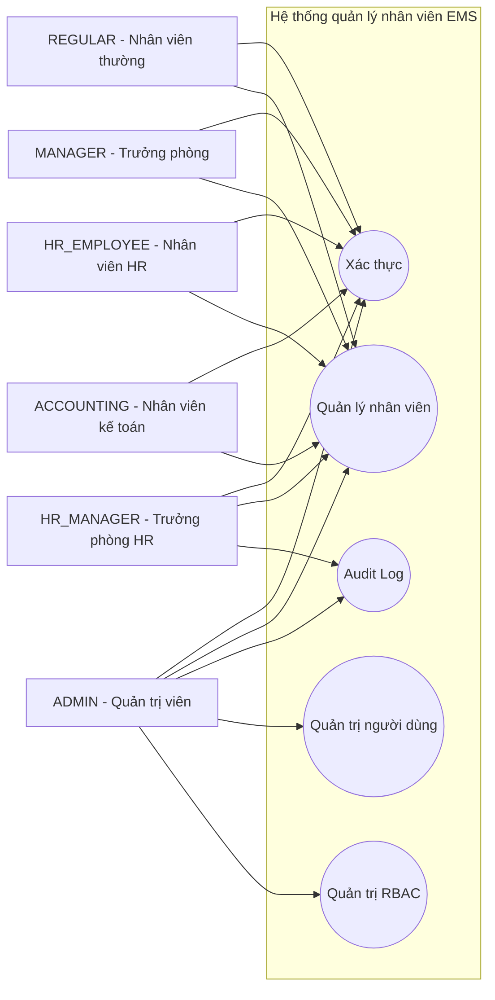
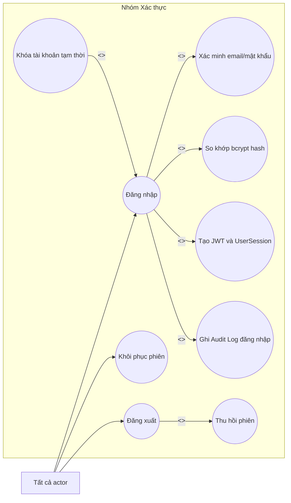
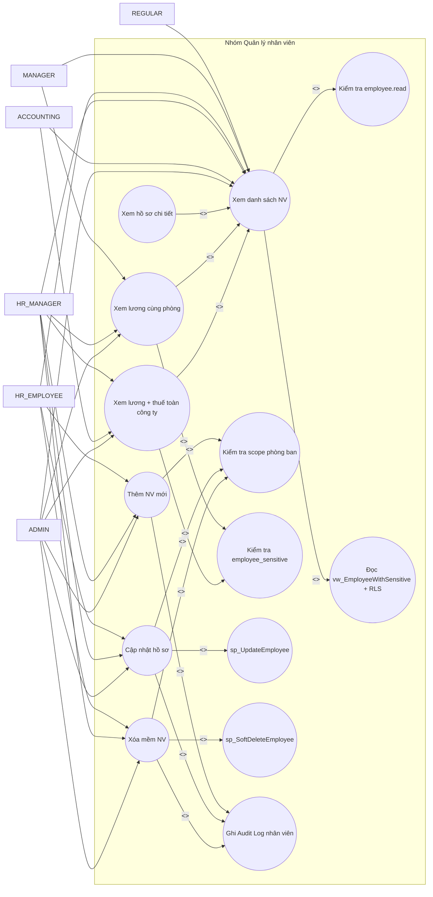
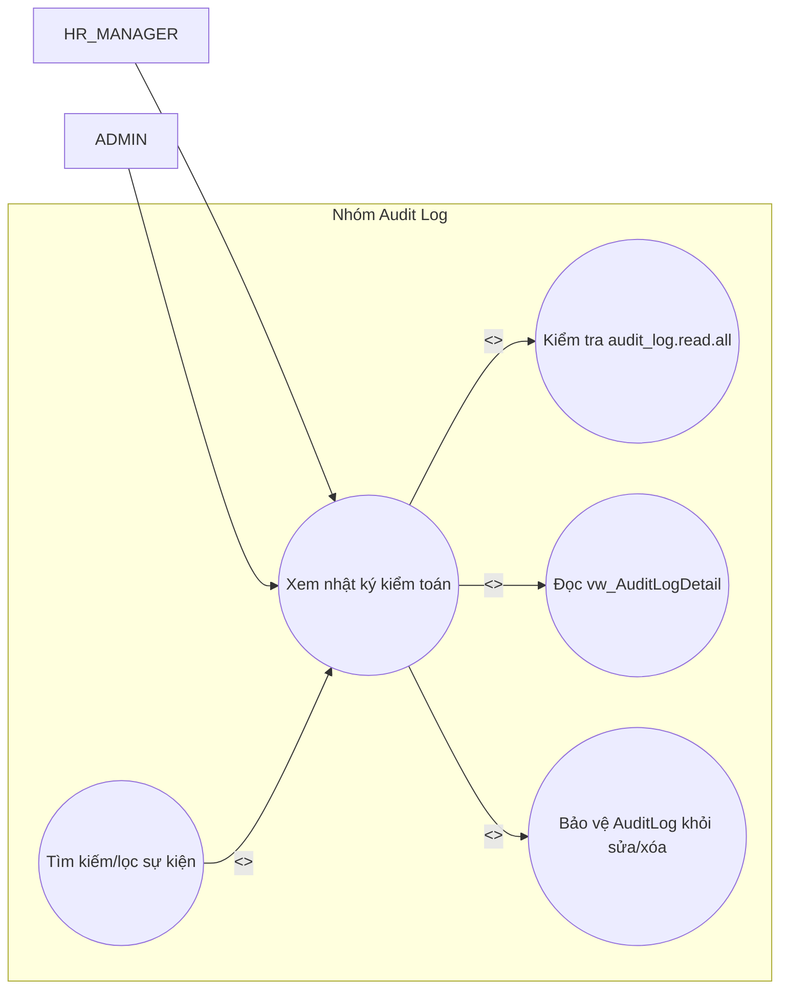
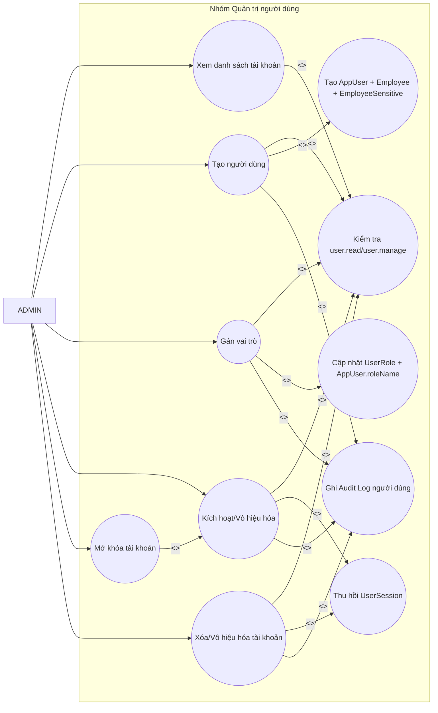
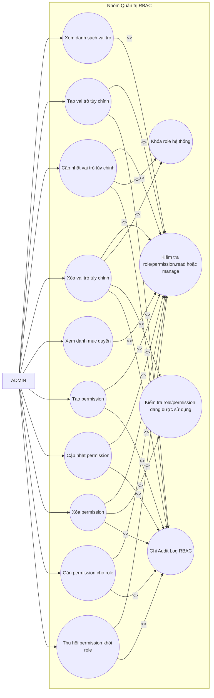

# BÁO CÁO TIỂU LUẬN CUỐI KỲ
## HỌC PHẦN: BẢO MẬT CƠ SỞ DỮ LIỆU

# ĐỀ TÀI: HỆ THỐNG QUẢN LÝ NHÂN VIÊN BẢO MẬT CƠ SỞ DỮ LIỆU

*(Xây dựng hệ thống quản lý nhân viên có phân quyền truy cập dữ liệu, kiểm soát bảo mật và ghi nhật ký hệ thống)*

---

# MỞ ĐẦU

## 1. Lý do chọn đề tài

Trong các hệ thống thông tin doanh nghiệp, dữ liệu nhân sự là nhóm dữ liệu có tính nhạy cảm cao. Bên cạnh các thông tin định danh thông thường như họ tên, ngày sinh, email và phòng ban, hệ thống nhân sự còn lưu trữ các dữ liệu cần được bảo vệ nghiêm ngặt như lương, mã số thuế và tài khoản ngân hàng. Nếu các thông tin này bị truy cập sai đối tượng hoặc bị chỉnh sửa trái phép, doanh nghiệp có thể gặp rủi ro về tài chính, pháp lý, uy tín nội bộ và tính minh bạch trong quản trị.

Bài toán quản lý nhân viên vì vậy không chỉ dừng lại ở việc xây dựng các chức năng thêm, xem, sửa, xóa hồ sơ. Một hệ thống phù hợp với yêu cầu của học phần Bảo mật cơ sở dữ liệu cần chứng minh được cách dữ liệu được kiểm soát ở nhiều lớp: người dùng phải đăng nhập hợp lệ, mỗi vai trò chỉ được thực hiện thao tác trong phạm vi cho phép, dữ liệu nhạy cảm phải được lọc trước khi hiển thị, và mọi thay đổi quan trọng phải để lại dấu vết kiểm toán.

Từ yêu cầu của đề tài “Quản lý nhân viên”, nhóm xây dựng hệ thống Employee Management System (EMS) dưới dạng một ứng dụng web nội bộ. Hệ thống không chỉ triển khai giao diện quản lý nhân viên, mà còn tập trung vào các cơ chế bảo mật cơ sở dữ liệu như phân quyền theo vai trò, kiểm soát truy cập theo phòng ban, quản lý phiên đăng nhập, Row-Level Security, stored procedure, trigger và audit log. Cách tiếp cận này giúp hệ thống hạn chế phụ thuộc vào một lớp bảo vệ duy nhất; thay vào đó, việc kiểm soát truy cập được phối hợp giữa giao diện, API backend và chính cơ sở dữ liệu SQL Server.

Đề tài được lựa chọn vì có tính thực tiễn cao và phù hợp với nội dung môn học. Thông qua quá trình xây dựng hệ thống, nhóm có thể vận dụng các kiến thức về thiết kế cơ sở dữ liệu, phân quyền, xác thực, quản lý phiên, bảo vệ dữ liệu nhạy cảm và ghi nhận nhật ký hệ thống vào một sản phẩm phần mềm hoàn chỉnh.

## 2. Nội dung thực hiện trong đề tài

Trong phạm vi tiểu luận, nhóm đã xây dựng một hệ thống quản lý nhân viên với các nội dung chính sau:

1. Thiết kế cơ sở dữ liệu SQL Server phục vụ quản lý nhân viên, phòng ban, tài khoản người dùng, vai trò, quyền truy cập, phiên đăng nhập và nhật ký kiểm toán.
2. Tách dữ liệu nhân viên thành dữ liệu hồ sơ cơ bản và dữ liệu nhạy cảm. Các trường như lương, mã số thuế và tài khoản ngân hàng được lưu trong bảng riêng để thuận lợi cho việc kiểm soát truy cập.
3. Xây dựng cơ chế xác thực bằng email và mật khẩu. Mật khẩu được băm bằng bcrypt, phiên đăng nhập được cấp bằng JWT, token được lưu ở cookie HttpOnly và chỉ lưu giá trị băm của token trong bảng `UserSession`.
4. Triển khai mô hình RBAC kết hợp giữa sáu vai trò hệ thống cố định và các bảng quản trị vai trò/quyền động gồm `Role`, `Permission`, `UserRole` và `RolePermission`.
5. Xây dựng tầng API bằng Express và tRPC. Các API nghiệp vụ đều đi qua thủ tục bảo vệ, kiểm tra phiên đăng nhập và gọi stored procedure `sp_CheckPermission` để quyết định quyền thực thi.
6. Áp dụng ngữ cảnh phiên làm việc của SQL Server thông qua `SESSION_CONTEXT`, giúp các view, stored procedure và Row-Level Security nhận biết người dùng hiện tại, vai trò và phòng ban của người đó.
7. Triển khai các stored procedure quan trọng như `sp_Authenticate`, `sp_RecordLoginSuccess`, `sp_RecordLoginFailure`, `sp_UpdateEmployee` và `sp_SoftDeleteEmployee` để xử lý đăng nhập, khóa tài khoản, cập nhật hồ sơ và xóa mềm nhân viên.
8. Ghi nhận audit log cho các thao tác quan trọng như đăng nhập thành công/thất bại, tạo/cập nhật/xóa nhân viên, quản lý người dùng, vai trò và quyền truy cập. Trigger tại cơ sở dữ liệu được dùng để ngăn sửa hoặc xóa bản ghi audit.
9. Xây dựng giao diện React cho các luồng nghiệp vụ chính: đăng nhập, dashboard nhân viên, hồ sơ nhân viên, audit log, quản trị người dùng, quản trị vai trò và quản trị danh mục quyền.

## 3. Bố cục báo cáo

Báo cáo được tổ chức thành ba chương chính:

- **Chương 1 - Tổng quan về đề tài:** Trình bày bối cảnh, mục tiêu, phạm vi, đối tượng sử dụng, yêu cầu chức năng, yêu cầu phi chức năng và phân tích actor/use case của hệ thống.
- **Chương 2 - Phân tích và thiết kế hệ thống:** Mô tả thiết kế cơ sở dữ liệu, quan hệ giữa các bảng, các giải pháp bảo mật được triển khai ở tầng cơ sở dữ liệu và tầng ứng dụng, đồng thời trình bày thiết kế giao diện hệ thống.
- **Chương 3 - Cài đặt thực nghiệm:** Trình bày quá trình cài đặt database, seed dữ liệu mẫu, triển khai backend/frontend, cấu hình môi trường và kiểm thử các tình huống phân quyền, xác thực và audit logging.

---

# CHƯƠNG 1. TỔNG QUAN VỀ ĐỀ TÀI

## 1.1. Giới thiệu đề tài

### 1.1.1. Bài toán quản lý nhân viên trong doanh nghiệp

Trong doanh nghiệp, hệ thống quản lý nhân viên thường chịu trách nhiệm lưu trữ thông tin về nhân sự, phòng ban, vai trò công việc và các thông tin phục vụ nghiệp vụ quản trị. Với đề tài này, thông tin nhân viên bao gồm mã nhân viên, họ tên, ngày sinh, email, phòng ban, lương, mã số thuế và tài khoản ngân hàng. Mỗi nhân viên thuộc một phòng ban, mỗi phòng ban có thể có trưởng phòng phụ trách.

Điểm quan trọng của bài toán không chỉ nằm ở khối lượng dữ liệu cần quản lý, mà nằm ở chính sách truy cập khác nhau giữa các nhóm người dùng. Nhân viên thông thường chỉ cần xem thông tin cơ bản của đồng nghiệp cùng phòng ban. Trưởng phòng cần xem thêm thông tin lương của nhân viên thuộc phòng mình. Nhân viên kế toán cần xem lương và mã số thuế để phục vụ nghiệp vụ tính lương, nhưng không được chỉnh sửa hồ sơ. Bộ phận nhân sự cần có quyền quản lý hồ sơ nhân viên theo phạm vi nghiệp vụ. Quản trị viên hệ thống cần quản lý tài khoản, vai trò và quyền truy cập.

Như vậy, bài toán quản lý nhân viên trong đề tài là bài toán kết hợp giữa quản lý dữ liệu nghiệp vụ và kiểm soát bảo mật dữ liệu. Hệ thống phải đảm bảo người dùng chỉ nhìn thấy và thao tác trên phần dữ liệu phù hợp với vai trò, phòng ban và quyền được cấp.

### 1.1.2. Vai trò của bảo mật cơ sở dữ liệu trong hệ thống quản lý nhân sự

Dữ liệu nhân sự có thể bị lộ hoặc bị thay đổi sai nếu cơ chế bảo vệ chỉ được đặt ở giao diện. Ví dụ, nếu frontend chỉ ẩn nút “Sửa” nhưng backend vẫn chấp nhận request cập nhật, người dùng có thể gọi API trực tiếp để vượt quyền. Tương tự, nếu backend có kiểm tra quyền nhưng tài khoản kết nối cơ sở dữ liệu lại được cấp quyền đọc trực tiếp toàn bộ bảng, dữ liệu vẫn có thể bị lộ khi có truy cập ngoài luồng vào database.

Do đó, hệ thống EMS được xây dựng theo hướng bảo mật nhiều lớp. Ở tầng giao diện, các route và nút chức năng được hiển thị theo vai trò người dùng. Ở tầng API, mọi procedure nghiệp vụ quan trọng đều yêu cầu đăng nhập và kiểm tra quyền thông qua `sp_CheckPermission`. Ở tầng SQL Server, hệ thống sử dụng database role, view có kiểm soát, stored procedure, trigger, Row-Level Security và `SESSION_CONTEXT` để tiếp tục thực thi chính sách bảo mật tại nơi dữ liệu được lưu trữ.

Cách triển khai này giúp hệ thống giảm rủi ro khi một lớp bảo vệ bị cấu hình sai hoặc bị bỏ qua. Dữ liệu nhạy cảm không được trả về chỉ dựa trên quyết định của giao diện, mà còn chịu sự kiểm soát của backend và cơ sở dữ liệu.

### 1.1.3. Giới thiệu hệ thống quản lý nhân viên

Employee Management System là ứng dụng web full-stack được xây dựng cho mục tiêu quản lý nhân viên gắn với bảo mật cơ sở dữ liệu. Hệ thống gồm ba tầng chính:

| Tầng hệ thống | Công nghệ sử dụng | Vai trò trong hệ thống |
|---|---|---|
| Frontend | React, Vite, TanStack Router, TanStack Query, Tailwind CSS | Cung cấp giao diện đăng nhập, dashboard, hồ sơ nhân viên, audit log và các trang quản trị |
| Backend/API | Node.js, Express, tRPC, Zod | Xử lý nghiệp vụ, xác thực, quản lý phiên, kiểm tra quyền và giao tiếp với cơ sở dữ liệu |
| Database | SQL Server, Prisma, migration SQL | Lưu trữ dữ liệu, thực thi stored procedure, trigger, view bảo mật và Row-Level Security |

Các route chính đã được triển khai trong hệ thống gồm `/login`, `/`, `/employee/$id`, `/audit`, `/audit-logs`, `/admin/users`, `/admin/roles` và `/admin/permissions`. Backend cung cấp các nhóm API theo module: `auth`, `employee`, `department`, `audit`, `user`, `role` và `permission`.

Về dữ liệu, hệ thống sử dụng các bảng chính như `AppUser`, `Employee`, `EmployeeSensitive`, `Department`, `Role`, `Permission`, `UserRole`, `RolePermission`, `UserSession` và `AuditLog`. Bên cạnh đó, database còn có các view phục vụ truy vấn an toàn như `vw_EmployeeDirectory`, `vw_EmployeeWithSensitive`, `vw_PayrollSummary`, `vw_DepartmentRoster` và `vw_AuditLogDetail`.

## 1.2. Mục tiêu và phạm vi đề tài

### 1.2.1. Mục tiêu hệ thống

Hệ thống được xây dựng nhằm đạt các mục tiêu sau:

| Mục tiêu | Nội dung triển khai |
|---|---|
| Quản lý hồ sơ nhân viên | Cho phép xem danh sách nhân viên, xem chi tiết hồ sơ, thêm nhân viên mới, cập nhật thông tin và xóa mềm nhân viên theo quyền được cấp |
| Bảo vệ dữ liệu nhạy cảm | Tách dữ liệu lương, mã số thuế, tài khoản ngân hàng sang `EmployeeSensitive`; kiểm soát việc đọc/ghi thông qua quyền và chính sách database |
| Xác thực và quản lý phiên | Đăng nhập bằng email/mật khẩu, bcrypt password hashing, JWT, cookie HttpOnly và bảng `UserSession` để theo dõi token còn hiệu lực |
| Phân quyền theo vai trò | Áp dụng sáu vai trò hệ thống và hỗ trợ quản trị role/permission động thông qua giao diện admin |
| Kiểm soát truy cập theo phòng ban | Sử dụng scope `own_department`, `other_department`, `all` để phân biệt phạm vi thao tác của từng vai trò |
| Ghi nhật ký kiểm toán | Lưu lịch sử đăng nhập, thao tác nhân viên, thao tác tài khoản, vai trò và quyền truy cập; bảo vệ audit log bằng trigger |
| Tăng tính an toàn tại tầng CSDL | Sử dụng stored procedure, view, database role, Row-Level Security và `SESSION_CONTEXT` để giảm phụ thuộc vào frontend |

### 1.2.2. Phạm vi nghiệp vụ

Phạm vi nghiệp vụ của hệ thống tập trung vào các chức năng cốt lõi phục vụ quản lý nhân viên và bảo mật dữ liệu:

| Nhóm nghiệp vụ | Trong phạm vi hệ thống |
|---|---|
| Quản lý nhân viên | Xem danh sách, xem hồ sơ, thêm mới, cập nhật, xóa mềm nhân viên |
| Quản lý phòng ban | Lưu thông tin phòng ban, trưởng phòng và dùng phòng ban làm căn cứ phân quyền |
| Quản lý tài khoản | Tạo tài khoản, khóa/mở khóa, kích hoạt/vô hiệu hóa, gán vai trò |
| Quản lý vai trò/quyền | Xem role hệ thống, tạo role tùy chỉnh, gán hoặc thu hồi permission |
| Xác thực | Đăng nhập, khôi phục phiên, đăng xuất, khóa tạm khi đăng nhập sai nhiều lần |
| Audit log | Ghi nhận và tra cứu các hoạt động quan trọng trong hệ thống |
| Bảo mật database | Stored procedure, trigger, view bảo mật, RLS và database role |

Một số chức năng nằm ngoài phạm vi phiên bản hiện tại gồm tính lương tự động, chấm công, nghỉ phép, quy trình phê duyệt nhân sự, gửi email thông báo, tích hợp hệ thống bên ngoài và triển khai production trên cloud. Schema hiện tại cũng chưa có bảng `PasswordHistory` hoặc `EmployeeAccessLogs` riêng; thay vào đó, hệ thống quản lý phiên bằng `UserSession` và theo dõi hoạt động quan trọng bằng `AuditLog`.

### 1.2.3. Đối tượng sử dụng hệ thống

Hệ thống phục vụ sáu nhóm người dùng chính:

| Actor | Vai trò trong hệ thống | Quyền tiêu biểu theo source code |
|---|---|---|
| Nhân viên thường | Người dùng nội bộ cơ bản | Xem thông tin nhân viên trong cùng phòng ban, không xem lương và không được chỉnh sửa |
| Trưởng phòng | Người quản lý phòng ban | Xem thông tin nhân viên cùng phòng, bao gồm dữ liệu lương trong phạm vi phòng ban |
| Nhân viên HR | Nhân viên phòng nhân sự | Xem dữ liệu nhân viên phục vụ nghiệp vụ HR; được tạo, cập nhật, xóa theo phạm vi ngoài phòng ban của mình |
| Trưởng phòng HR | Người quản lý bộ phận nhân sự | Có quyền rộng với hồ sơ nhân viên, dữ liệu nhạy cảm, phòng ban và audit log |
| Nhân viên kế toán | Người xử lý nghiệp vụ lương | Xem dữ liệu nhân viên và dữ liệu nhạy cảm để phục vụ nghiệp vụ kế toán, không có quyền chỉnh sửa |
| Admin | Quản trị viên hệ thống | Toàn quyền quản lý nhân viên, tài khoản, vai trò, quyền truy cập và audit log |

## 1.3. Yêu cầu chức năng của hệ thống

### 1.3.1. Chức năng xác thực người dùng

Người dùng truy cập hệ thống thông qua màn hình đăng nhập tại route `/login`. Khi người dùng nhập email và mật khẩu, frontend gửi yêu cầu đến `auth.login`. Backend gọi stored procedure `sp_Authenticate` để kiểm tra trạng thái tài khoản: tài khoản có tồn tại hay không, có bị vô hiệu hóa hay không, có đang bị khóa tạm thời hay không. Nếu tài khoản hợp lệ, backend dùng bcrypt để so sánh mật khẩu người dùng nhập với password hash lưu trong database.

Khi đăng nhập thành công, hệ thống tạo JWT có thời hạn 7 ngày, băm token bằng SHA-256 và lưu token hash vào bảng `UserSession` thông qua `sp_RecordLoginSuccess`. Token thật được gửi về trình duyệt bằng cookie HttpOnly nhằm hạn chế truy cập từ JavaScript phía client. Khi đăng nhập thất bại, `sp_RecordLoginFailure` tăng bộ đếm `failedAttempts`; nếu số lần sai đạt ngưỡng, tài khoản bị khóa tạm thời trong 30 phút. Các sự kiện đăng nhập thành công và thất bại được ghi vào `AuditLog` với action `LOGIN_SUCCESS` hoặc `LOGIN_FAILURE`.

Khi người dùng tải lại trang, layout gọi `auth.session`. Backend xác minh JWT, so khớp token hash trong `UserSession`, kiểm tra `revokedAt` và `expiresAt`, sau đó mới khôi phục thông tin người dùng hiện tại. Khi đăng xuất, hệ thống đánh dấu phiên hiện tại là đã thu hồi và xóa cookie phía trình duyệt.

### 1.3.2. Chức năng quản lý thông tin nhân viên

Hệ thống cung cấp dashboard tại route `/` để hiển thị danh sách nhân viên theo phạm vi người dùng được phép xem. Danh sách nhân viên được lấy từ API `employee.getAll`; backend kiểm tra quyền `employee.read` và đọc dữ liệu qua view `vw_EmployeeWithSensitive`. Dữ liệu trả về có thể đầy đủ hoặc bị giới hạn tùy theo vai trò, phòng ban và chính sách RLS tại database.

Khi mở hồ sơ nhân viên tại `/employee/$id`, hệ thống hiển thị các nhóm thông tin gồm thông tin cá nhân, email, phòng ban, vai trò, lương và mã số thuế. Các trường nhạy cảm chỉ hiển thị khi người dùng có quyền tương ứng. Nếu người dùng có quyền chỉnh sửa, giao diện cho phép cập nhật hồ sơ; nếu không, các trường sẽ ở chế độ chỉ đọc hoặc bị ẩn.

Chức năng thêm nhân viên mới được thực hiện tại `/employee/new`. Khi tạo nhân viên, backend tạo đồng thời tài khoản ứng dụng (`AppUser`), hồ sơ nhân viên (`Employee`) và dữ liệu nhạy cảm (`EmployeeSensitive`). Mật khẩu ban đầu được băm bằng bcrypt. Chức năng xóa nhân viên không xóa vật lý khỏi database mà gọi `sp_SoftDeleteEmployee` để chuyển trạng thái nhân viên thành `TERMINATED`, vô hiệu hóa tài khoản liên quan và thu hồi các phiên đang hoạt động.

### 1.3.3. Chức năng quản lý tài khoản người dùng

Trang `/admin/users` phục vụ quản trị tài khoản. Admin có thể xem danh sách người dùng, tạo tài khoản mới, gán vai trò, kích hoạt hoặc vô hiệu hóa tài khoản, mở khóa tài khoản sau nhiều lần đăng nhập sai và xóa/vô hiệu hóa tài khoản.

Khi tạo người dùng mới, hệ thống tạo bản ghi tài khoản, hồ sơ nhân viên, dữ liệu nhạy cảm và bản ghi `UserRole`. Khi gán vai trò, hệ thống thay thế bản ghi role cũ bằng role mới, đồng thời cập nhật trường `AppUser.roleName`. Trường này đóng vai trò như giá trị cache để backend và SQL Server có thể đưa role hiện tại vào `SESSION_CONTEXT`.

Các thao tác quản trị tài khoản đều yêu cầu quyền `user.manage.all` hoặc quyền cụ thể tương ứng trong permission catalog. Hệ thống cũng chặn các thao tác nguy hiểm như tự vô hiệu hóa hoặc tự xóa tài khoản của chính admin đang đăng nhập.

### 1.3.4. Chức năng quản lý vai trò và phân quyền

Hệ thống triển khai sáu vai trò hệ thống gồm `REGULAR`, `MANAGER`, `HR_EMPLOYEE`, `HR_MANAGER`, `ACCOUNTING` và `ADMIN`. Các vai trò này được seed ban đầu và được đánh dấu là system role. Trang `/admin/roles` cho phép admin xem danh sách vai trò, số người dùng đang được gán, số quyền của từng vai trò và danh sách permission đi kèm.

Đối với role hệ thống, giao diện chỉ cho phép xem, không cho phép sửa tên, mô tả hoặc thay đổi quyền. Đối với role tùy chỉnh, admin có thể tạo mới, cập nhật thông tin, xóa nếu role chưa được gán cho người dùng nào, đồng thời gán hoặc thu hồi permission.

Quyền truy cập được biểu diễn theo dạng `resource.action.scope`, ví dụ `employee.read.own_department`, `employee_sensitive.read.all`, `audit_log.read.all` hoặc `user.manage.all`. Khi backend cần kiểm tra quyền, hàm `assertPermission` gọi stored procedure `sp_CheckPermission`; procedure này xử lý cả vai trò hệ thống lẫn vai trò tùy chỉnh.

### 1.3.5. Chức năng kiểm tra nhật ký hệ thống

Trang `/audit` và route alias `/audit-logs` hiển thị nhật ký kiểm toán của hệ thống. Trước khi tải dữ liệu, frontend kiểm tra khả năng truy cập audit log bằng quyền tĩnh theo role hoặc gọi `permission.check`. Backend endpoint `audit.getAll` yêu cầu quyền `audit_log.read.all` và đọc dữ liệu từ view `vw_AuditLogDetail`.

Audit log lưu thông tin về người thực hiện, bảng/đối tượng bị tác động, loại hành động, giá trị trước khi thay đổi, giá trị sau khi thay đổi, địa chỉ IP và user agent. View `vw_AuditLogDetail` làm giàu dữ liệu bằng cách hiển thị tên actor và tên đối tượng liên quan thay vì chỉ hiển thị mã định danh.

### 1.3.6. Chức năng giám sát truy cập dữ liệu

Hệ thống giám sát truy cập và thay đổi dữ liệu theo hai hướng. Thứ nhất, các thao tác thay đổi quan trọng ở backend đều tạo bản ghi `AuditLog`, bao gồm tạo/cập nhật/xóa nhân viên, tạo/cập nhật/xóa tài khoản, gán vai trò, tạo/cập nhật/xóa role và permission. Thứ hai, database có các trigger hỗ trợ tự động ghi nhận hoặc bảo vệ dữ liệu, tiêu biểu là trigger ghi thay đổi dữ liệu nhạy cảm và trigger ngăn sửa/xóa audit log.

Việc kết hợp audit từ tầng ứng dụng và trigger từ tầng cơ sở dữ liệu giúp hệ thống có khả năng truy vết rõ ràng hơn. Khi phát sinh sự cố, quản trị viên hoặc trưởng phòng HR có thể xem lịch sử thay đổi để xác định ai đã thực hiện thao tác, thao tác xảy ra vào thời điểm nào và dữ liệu nào đã bị tác động.

## 1.4. Yêu cầu phi chức năng

### 1.4.1. Bảo mật

Hệ thống đặt yêu cầu bảo mật làm trọng tâm. Mật khẩu không được lưu dạng rõ mà được băm bằng bcrypt. JWT được lưu ở cookie HttpOnly, còn database chỉ lưu token hash để phục vụ đối chiếu và thu hồi phiên. Mỗi request được bảo vệ đi qua `protectedProcedure`; trước khi truy cập dữ liệu, backend kiểm tra phiên đăng nhập và thiết lập `SESSION_CONTEXT` gồm `UserId`, `RoleName` và `DepartmentId`.

Về phân quyền, backend không dựa vào frontend để quyết định quyền. Giao diện có thể ẩn/hiện nút theo vai trò, nhưng quyền thực thi cuối cùng nằm ở API và stored procedure. Tại SQL Server, các database role như `ems_regular`, `ems_manager`, `ems_hr_employee`, `ems_hr_manager`, `ems_accounting`, `ems_admin` và `ems_app_runtime` được dùng để giới hạn truy cập trực tiếp. Các role người dùng thông thường bị deny trên base table nhạy cảm và chỉ được đọc qua view hoặc thực thi procedure được cấp phép.

### 1.4.2. Hiệu năng

Frontend sử dụng TanStack Query để cache dữ liệu sau khi gọi API, giảm số lần request lặp lại và giúp giao diện phản hồi nhanh hơn khi người dùng chuyển trang hoặc lọc dữ liệu. tRPC sử dụng `httpBatchLink` để gom các lời gọi API khi phù hợp, từ đó giảm overhead mạng.

Ở tầng cơ sở dữ liệu, migration tạo các chỉ mục trên các cột thường dùng như `Employee.departmentId`, `Employee.userId`, `Employee.status`, `AuditLog.timestamp`, `AuditLog.actorId`, `UserSession.userId` và `UserSession.tokenHash`. Các chỉ mục này hỗ trợ truy vấn danh sách nhân viên, kiểm tra phiên và xem audit log theo thời gian.

### 1.4.3. Tính toàn vẹn dữ liệu

Schema sử dụng khóa chính, khóa ngoại, unique constraint và check constraint để bảo vệ tính hợp lệ của dữ liệu. Ví dụ, email tài khoản là duy nhất, mỗi nhân viên liên kết với một tài khoản, mỗi nhân viên có một bản ghi dữ liệu nhạy cảm, trạng thái nhân viên chỉ nằm trong các giá trị hợp lệ, lương không được âm và mã số thuế phải đạt độ dài tối thiểu.

Hệ thống không cho phép hard delete nhân viên. Thay vào đó, stored procedure `sp_SoftDeleteEmployee` thực hiện xóa mềm trong một giao dịch: cập nhật trạng thái nhân viên, vô hiệu hóa tài khoản, xóa liên kết trưởng phòng nếu cần, thu hồi phiên đăng nhập và ghi audit log. Audit log cũng được bảo vệ bằng trigger `tr_AuditLog_PreventModification`, ngăn sửa hoặc xóa bản ghi đã được tạo.

### 1.4.4. Khả năng mở rộng

Hệ thống có kiến trúc tách biệt frontend, backend và database, giúp từng phần có thể mở rộng hoặc điều chỉnh độc lập. Việc sử dụng tRPC giúp frontend gọi API theo kiểu type-safe, giảm lỗi sai kiểu dữ liệu giữa client và server. Prisma hỗ trợ quản lý schema và migration, giúp việc thay đổi cấu trúc dữ liệu có thể theo dõi qua lịch sử migration.

Mô hình RBAC động tạo tiền đề mở rộng quyền truy cập mà không phải sửa trực tiếp toàn bộ source code. Admin có thể tạo thêm permission, tạo role tùy chỉnh và gán quyền cho role. Các quyền mới sau đó được backend kiểm tra thông qua `sp_CheckPermission`.

## 1.5. Phân tích Actor và Use Case

### 1.5.1. Danh sách Actor

| Actor | Mô tả | Phạm vi quyền chính |
|---|---|---|
| Nhân viên thường | Nhân viên thuộc một phòng ban | Đăng nhập, xem danh sách/hồ sơ nhân viên trong phạm vi được phép, không xem lương |
| Trưởng phòng | Nhân viên quản lý phòng ban | Xem nhân viên cùng phòng và xem dữ liệu lương trong phạm vi phòng ban |
| Nhân viên HR | Nhân viên phòng nhân sự | Xem dữ liệu nhân viên phục vụ nghiệp vụ HR; thêm/sửa/xóa theo scope được cấp |
| Trưởng phòng HR | Quản lý cấp cao của bộ phận nhân sự | Quản lý toàn bộ hồ sơ nhân viên, xem audit log, quản lý phòng ban theo quyền |
| Nhân viên kế toán | Người phụ trách nghiệp vụ lương | Xem thông tin nhân viên và dữ liệu nhạy cảm phục vụ tính lương, không chỉnh sửa |
| Admin | Quản trị viên hệ thống | Quản trị toàn hệ thống, bao gồm users, roles, permissions và audit |

### 1.5.2. Danh sách Use Case chính

| Nhóm use case | Use case |
|---|---|
| Xác thực | Đăng nhập, khôi phục phiên, đăng xuất, khóa tài khoản tạm thời khi đăng nhập sai nhiều lần |
| Quản lý nhân viên | Xem danh sách, xem hồ sơ chi tiết, xem dữ liệu nhạy cảm theo quyền, thêm nhân viên, cập nhật hồ sơ, xóa mềm nhân viên |
| Audit Log | Ghi nhận thao tác quan trọng, xem nhật ký kiểm toán, tìm kiếm và lọc sự kiện |
| Quản trị người dùng | Xem danh sách tài khoản, tạo người dùng, khóa/mở khóa, kích hoạt/vô hiệu hóa, gán vai trò, xóa/vô hiệu hóa tài khoản |
| Quản trị RBAC | Xem vai trò/quyền, tạo vai trò tùy chỉnh, cập nhật/xóa vai trò tùy chỉnh, tạo/cập nhật/xóa permission, gán/thu hồi permission cho role |

### 1.5.3. Sơ đồ Use Case tổng thể

Sơ đồ Use Case tổng thể được trình bày ở mức nhóm chức năng. Mục tiêu của sơ đồ này là thể hiện actor nào được phép truy cập vào từng phân hệ chính của hệ thống, chưa đi sâu vào từng thao tác con.

Từ sơ đồ tổng thể có thể thấy mọi actor đều cần đi qua nhóm chức năng xác thực trước khi sử dụng hệ thống. Nhóm quản lý nhân viên là nhóm nghiệp vụ trung tâm và có sự tham gia của tất cả actor, tuy nhiên dữ liệu và thao tác cụ thể sẽ bị giới hạn bởi vai trò. Các nhóm Audit Log, Quản trị người dùng và Quản trị RBAC chỉ được mở cho actor có quyền quản trị hoặc quyền giám sát phù hợp.

### 1.5.4. Sơ đồ Use Case phân rã theo nhóm chức năng

#### 1.5.4.1. Nhóm Xác thực

Nhóm xác thực chịu trách nhiệm kiểm tra danh tính người dùng, quản lý phiên đăng nhập và khóa tạm thời tài khoản khi phát hiện đăng nhập sai nhiều lần. Source code hiện thực nhóm này trong `authRouter`, các stored procedure `sp_Authenticate`, `sp_RecordLoginSuccess`, `sp_RecordLoginFailure` và bảng `UserSession`.

#### 1.5.4.2. Nhóm Quản lý nhân viên

Nhóm quản lý nhân viên là nhóm chức năng chính của hệ thống. Mọi actor đều có thể xem dữ liệu nhân viên, nhưng mức dữ liệu được trả về khác nhau theo vai trò. Các thao tác thêm, cập nhật và xóa mềm chỉ dành cho HR hoặc Admin theo phạm vi quyền đã được kiểm tra ở backend và SQL Server.

Trong source code, việc xem danh sách nhân viên được xử lý qua `employee.getAll`, sau đó dữ liệu được đọc từ `vw_EmployeeWithSensitive`. Với REGULAR, dữ liệu bị giới hạn ở phạm vi cùng phòng ban và không bao gồm lương. Với MANAGER, chức năng xem lương cùng phòng là phần mở rộng của xem danh sách. Với ACCOUNTING, chức năng xem lương và mã số thuế toàn công ty cũng là phần mở rộng của xem danh sách, nhưng chỉ phục vụ mục đích đọc dữ liệu. Với HR_EMPLOYEE, các thao tác thêm, cập nhật, xóa mềm luôn bao gồm bước kiểm tra scope phòng ban; cập nhật hồ sơ đi qua `sp_UpdateEmployee`, còn xóa nhân viên đi qua `sp_SoftDeleteEmployee`.

#### 1.5.4.3. Nhóm Audit Log

Nhóm Audit Log phục vụ việc theo dõi hoạt động hệ thống. Trong triển khai hiện tại, HR_MANAGER và ADMIN có quyền xem audit log theo chính sách hệ thống; ngoài ra, nếu hệ thống có role tùy chỉnh được cấp `audit_log.read.all`, role đó cũng có thể được backend cho phép truy cập.

#### 1.5.4.4. Nhóm Quản trị người dùng

Nhóm quản trị người dùng được triển khai tại route `/admin/users` và các API trong `userRouter`. Các thao tác trong nhóm này chỉ dành cho ADMIN hoặc role có quyền quản trị người dùng tương đương.

#### 1.5.4.5. Nhóm Quản trị RBAC

Nhóm quản trị RBAC bao gồm quản lý vai trò và danh mục quyền truy cập. Hệ thống cho phép tạo role tùy chỉnh và gán permission cho role, nhưng khóa các role hệ thống để đảm bảo chính sách mặc định không bị thay đổi tùy tiện.

### 1.5.5. Mô tả chi tiết các sơ đồ Use Case

Mục này mô tả chi tiết cách dựng lại các sơ đồ Use Case đã trình bày ở trên. Khi vẽ bằng Draw.io, nên sử dụng phong cách đen trắng, tối giản: actor đặt ngoài khung hệ thống, use case đặt trong khung hệ thống, đường thẳng liền thể hiện association, đường nét đứt có nhãn `<<include>>` hoặc `<<extend>>` thể hiện quan hệ giữa các use case.

#### 1.5.5.1. Sơ đồ Use Case tổng thể

Sơ đồ tổng thể thể hiện quan hệ giữa sáu actor và năm nhóm chức năng lớn của hệ thống. Đây là sơ đồ mức cao, dùng để trình bày phạm vi tổng quan trước khi phân rã từng nhóm nghiệp vụ.

**Actor cần vẽ**

| Actor | Vị trí gợi ý trên sơ đồ |
|---|---|
| REGULAR - Nhân viên thường | Bên trái khung hệ thống |
| MANAGER - Trưởng phòng | Bên trái khung hệ thống, dưới REGULAR |
| HR_EMPLOYEE - Nhân viên HR | Bên trái hoặc bên phải khung hệ thống |
| HR_MANAGER - Trưởng phòng HR | Bên phải khung hệ thống |
| ACCOUNTING - Nhân viên kế toán | Bên phải khung hệ thống |
| ADMIN - Quản trị viên | Bên phải khung hệ thống, gần nhóm quản trị |

**Use case cần vẽ trong khung hệ thống**

| Nhóm chức năng | Use case biểu diễn |
|---|---|
| Xác thực | Xác thực |
| Quản lý nhân viên | Quản lý nhân viên |
| Audit Log | Audit Log |
| Quản trị người dùng | Quản trị người dùng |
| Quản trị RBAC | Quản trị RBAC |

**Association giữa actor và use case**

- REGULAR nối đến `Xác thực` và `Quản lý nhân viên`.
- MANAGER nối đến `Xác thực` và `Quản lý nhân viên`.
- HR_EMPLOYEE nối đến `Xác thực` và `Quản lý nhân viên`.
- HR_MANAGER nối đến `Xác thực`, `Quản lý nhân viên` và `Audit Log`.
- ACCOUNTING nối đến `Xác thực` và `Quản lý nhân viên`.
- ADMIN nối đến cả năm use case tổng quát: `Xác thực`, `Quản lý nhân viên`, `Audit Log`, `Quản trị người dùng`, `Quản trị RBAC`.

**Bố cục khuyến nghị**

Vẽ một hình chữ nhật lớn đặt tên `Hệ thống quản lý nhân viên EMS`. Bên trong khung, đặt `Xác thực` ở phía trên cùng vì mọi actor đều phải đi qua bước này. Đặt `Quản lý nhân viên` ở giữa vì đây là nghiệp vụ trung tâm. Đặt `Audit Log` bên phải `Quản lý nhân viên`. Đặt `Quản trị người dùng` và `Quản trị RBAC` ở góc dưới bên phải vì chỉ ADMIN tương tác trực tiếp với hai nhóm này. Sơ đồ tổng thể không cần vẽ quan hệ `include` hoặc `extend`; chỉ dùng association giữa actor và nhóm chức năng.

#### 1.5.5.2. Sơ đồ phân rã nhóm Xác thực

Sơ đồ này mô tả cách người dùng đăng nhập, khôi phục phiên và đăng xuất. Vì mọi vai trò đều sử dụng cùng cơ chế xác thực, chỉ cần một actor tổng quát là `Tất cả actor`.

**Actor cần vẽ**

| Actor | Ý nghĩa |
|---|---|
| Tất cả actor | Đại diện cho toàn bộ người dùng có thể đăng nhập hệ thống |

**Use case cần vẽ**

| Use case | Vai trò trong sơ đồ |
|---|---|
| Đăng nhập | Use case chính để bắt đầu phiên làm việc |
| Khôi phục phiên | Kiểm tra phiên còn hợp lệ khi người dùng tải lại trang |
| Đăng xuất | Kết thúc phiên làm việc hiện tại |
| Xác minh email/mật khẩu | Use case con bắt buộc của đăng nhập |
| So khớp bcrypt hash | Use case con kiểm tra mật khẩu đã băm |
| Tạo JWT và UserSession | Use case con tạo phiên sau khi xác thực thành công |
| Thu hồi phiên | Use case con khi đăng xuất |
| Ghi Audit Log đăng nhập | Use case con ghi nhận đăng nhập thành công/thất bại |
| Khóa tài khoản tạm thời | Use case mở rộng khi đăng nhập sai quá số lần quy định |

**Association giữa actor và use case**

- `Tất cả actor` nối trực tiếp đến `Đăng nhập`.
- `Tất cả actor` nối trực tiếp đến `Khôi phục phiên`.
- `Tất cả actor` nối trực tiếp đến `Đăng xuất`.

**Quan hệ include và extend**

- `Đăng nhập` `<<include>>` `Xác minh email/mật khẩu`.
- `Đăng nhập` `<<include>>` `So khớp bcrypt hash`.
- `Đăng nhập` `<<include>>` `Tạo JWT và UserSession`.
- `Đăng nhập` `<<include>>` `Ghi Audit Log đăng nhập`.
- `Đăng xuất` `<<include>>` `Thu hồi phiên`.
- `Khóa tài khoản tạm thời` `<<extend>>` `Đăng nhập`, vì chỉ xảy ra trong tình huống đăng nhập thất bại nhiều lần.

**Bố cục khuyến nghị**

Đặt actor ở bên trái. Trong khung `Nhóm Xác thực`, đặt ba use case chính `Đăng nhập`, `Khôi phục phiên`, `Đăng xuất` theo chiều dọc từ trên xuống. Đặt các use case con của `Đăng nhập` ở bên phải `Đăng nhập` để dễ nối đường nét đứt `<<include>>`. Đặt `Khóa tài khoản tạm thời` phía dưới hoặc phía phải `Đăng nhập`, nối bằng nét đứt `<<extend>>` hướng về `Đăng nhập`. Đặt `Thu hồi phiên` bên phải `Đăng xuất`.

#### 1.5.5.3. Sơ đồ phân rã nhóm Quản lý nhân viên

Sơ đồ này là sơ đồ nghiệp vụ quan trọng nhất, thể hiện rõ sự khác biệt quyền truy cập giữa các actor. Mục tiêu khi vẽ là làm nổi bật: mọi actor đều có thể xem danh sách nhân viên, nhưng quyền xem lương, xem thuế, thêm, cập nhật và xóa mềm phụ thuộc vào vai trò.

**Actor cần vẽ**

| Actor | Vai trò trong nhóm Quản lý nhân viên |
|---|---|
| REGULAR | Xem danh sách nhân viên trong phạm vi được phép, không xem lương |
| MANAGER | Xem danh sách và xem lương nhân viên cùng phòng |
| HR_EMPLOYEE | Xem danh sách, thêm, cập nhật, xóa mềm theo scope phòng ban |
| HR_MANAGER | Quản lý hồ sơ nhân viên với phạm vi rộng hơn HR_EMPLOYEE |
| ACCOUNTING | Xem danh sách và xem lương, mã số thuế toàn công ty |
| ADMIN | Có toàn bộ quyền trong nhóm quản lý nhân viên |

**Use case cần vẽ**

| Use case | Vai trò trong sơ đồ |
|---|---|
| Xem danh sách NV | Use case trung tâm, được nhiều actor sử dụng |
| Xem hồ sơ chi tiết | Mở rộng từ xem danh sách |
| Xem lương cùng phòng | Mở rộng từ xem danh sách, dành cho MANAGER và các role cao hơn |
| Xem lương + thuế toàn công ty | Mở rộng từ xem danh sách, dành cho ACCOUNTING, HR_MANAGER, ADMIN |
| Thêm NV mới | Tạo nhân viên mới |
| Cập nhật hồ sơ | Cập nhật thông tin nhân viên |
| Xóa mềm NV | Vô hiệu hóa nhân viên thay vì xóa vật lý |
| Kiểm tra employee.read | Bước kiểm tra quyền khi xem dữ liệu |
| Kiểm tra scope phòng ban | Bước kiểm tra phạm vi thao tác khi thêm/sửa/xóa |
| Kiểm tra employee_sensitive | Bước kiểm tra quyền với dữ liệu nhạy cảm |
| Đọc vw_EmployeeWithSensitive + RLS | Bước truy xuất dữ liệu qua view và Row-Level Security |
| sp_UpdateEmployee | Bước xử lý cập nhật hồ sơ ở tầng CSDL |
| sp_SoftDeleteEmployee | Bước xử lý xóa mềm ở tầng CSDL |
| Ghi Audit Log nhân viên | Bước ghi nhật ký khi có thao tác thay đổi |

**Association giữa actor và use case**

- REGULAR nối đến `Xem danh sách NV`.
- MANAGER nối đến `Xem danh sách NV` và `Xem lương cùng phòng`.
- HR_EMPLOYEE nối đến `Xem danh sách NV`, `Thêm NV mới`, `Cập nhật hồ sơ`, `Xóa mềm NV`.
- HR_MANAGER nối đến `Xem danh sách NV`, `Xem lương cùng phòng`, `Xem lương + thuế toàn công ty`, `Thêm NV mới`, `Cập nhật hồ sơ`, `Xóa mềm NV`.
- ACCOUNTING nối đến `Xem danh sách NV` và `Xem lương + thuế toàn công ty`.
- ADMIN nối đến toàn bộ use case nghiệp vụ chính trong nhóm: `Xem danh sách NV`, `Xem lương cùng phòng`, `Xem lương + thuế toàn công ty`, `Thêm NV mới`, `Cập nhật hồ sơ`, `Xóa mềm NV`.

**Quan hệ include và extend**

- `Xem danh sách NV` `<<include>>` `Kiểm tra employee.read`.
- `Xem danh sách NV` `<<include>>` `Đọc vw_EmployeeWithSensitive + RLS`.
- `Xem hồ sơ chi tiết` `<<extend>>` `Xem danh sách NV`.
- `Xem lương cùng phòng` `<<extend>>` `Xem danh sách NV`.
- `Xem lương + thuế toàn công ty` `<<extend>>` `Xem danh sách NV`.
- `Xem lương cùng phòng` `<<include>>` `Kiểm tra employee_sensitive`.
- `Xem lương + thuế toàn công ty` `<<include>>` `Kiểm tra employee_sensitive`.
- `Thêm NV mới` `<<include>>` `Kiểm tra scope phòng ban`.
- `Thêm NV mới` `<<include>>` `Ghi Audit Log nhân viên`.
- `Cập nhật hồ sơ` `<<include>>` `Kiểm tra scope phòng ban`.
- `Cập nhật hồ sơ` `<<include>>` `sp_UpdateEmployee`.
- `Cập nhật hồ sơ` `<<include>>` `Ghi Audit Log nhân viên`.
- `Xóa mềm NV` `<<include>>` `Kiểm tra scope phòng ban`.
- `Xóa mềm NV` `<<include>>` `sp_SoftDeleteEmployee`.
- `Xóa mềm NV` `<<include>>` `Ghi Audit Log nhân viên`.

**Bố cục khuyến nghị**

Đặt các actor đọc dữ liệu ở bên trái: REGULAR, MANAGER, ACCOUNTING. Đặt các actor có quyền quản lý ở bên phải: HR_EMPLOYEE, HR_MANAGER, ADMIN. Trong khung `Nhóm Quản lý nhân viên`, đặt `Xem danh sách NV` ở trung tâm. Đặt các use case mở rộng đọc dữ liệu (`Xem hồ sơ chi tiết`, `Xem lương cùng phòng`, `Xem lương + thuế toàn công ty`) ở phía trên hoặc bên phải `Xem danh sách NV`. Đặt các use case thay đổi dữ liệu (`Thêm NV mới`, `Cập nhật hồ sơ`, `Xóa mềm NV`) thành một cụm riêng ở nửa dưới. Các use case kiểm tra quyền và stored procedure nên đặt sát use case chính mà chúng phục vụ để tránh đường nối chồng chéo.

#### 1.5.5.4. Sơ đồ phân rã nhóm Audit Log

Sơ đồ Audit Log mô tả chức năng xem và lọc nhật ký kiểm toán. Đây là nhóm chức năng phục vụ giám sát, không làm thay đổi dữ liệu nghiệp vụ.

**Actor cần vẽ**

| Actor | Vai trò |
|---|---|
| HR_MANAGER | Xem nhật ký để giám sát hoạt động liên quan đến nghiệp vụ nhân sự |
| ADMIN | Xem toàn bộ nhật ký phục vụ quản trị hệ thống |

**Use case cần vẽ**

| Use case | Vai trò trong sơ đồ |
|---|---|
| Xem nhật ký kiểm toán | Use case chính |
| Tìm kiếm/lọc sự kiện | Mở rộng chức năng xem nhật ký |
| Kiểm tra audit_log.read.all | Bước kiểm tra quyền bắt buộc |
| Đọc vw_AuditLogDetail | Bước truy xuất dữ liệu audit đã được làm giàu |
| Bảo vệ AuditLog khỏi sửa/xóa | Cơ chế đảm bảo dữ liệu audit không bị thay đổi |

**Association giữa actor và use case**

- HR_MANAGER nối đến `Xem nhật ký kiểm toán`.
- ADMIN nối đến `Xem nhật ký kiểm toán`.

**Quan hệ include và extend**

- `Xem nhật ký kiểm toán` `<<include>>` `Kiểm tra audit_log.read.all`.
- `Xem nhật ký kiểm toán` `<<include>>` `Đọc vw_AuditLogDetail`.
- `Tìm kiếm/lọc sự kiện` `<<extend>>` `Xem nhật ký kiểm toán`, vì lọc và tìm kiếm chỉ xảy ra sau khi danh sách audit đã được hiển thị.
- `Xem nhật ký kiểm toán` `<<include>>` `Bảo vệ AuditLog khỏi sửa/xóa`, thể hiện chính sách hệ thống luôn bảo vệ tính bất biến của audit log.

**Bố cục khuyến nghị**

Đặt HR_MANAGER và ADMIN bên trái khung. Đặt `Xem nhật ký kiểm toán` ở giữa. Đặt `Kiểm tra audit_log.read.all` phía trên hoặc bên phải use case chính. Đặt `Đọc vw_AuditLogDetail` phía phải use case chính. Đặt `Tìm kiếm/lọc sự kiện` phía dưới `Xem nhật ký kiểm toán` và nối bằng `<<extend>>`. Đặt `Bảo vệ AuditLog khỏi sửa/xóa` ở góc dưới bên phải để thể hiện đây là cơ chế nền của hệ thống.

#### 1.5.5.5. Sơ đồ phân rã nhóm Quản trị người dùng

Sơ đồ này mô tả các thao tác quản trị tài khoản người dùng. Trong hệ thống hiện tại, nhóm này chủ yếu dành cho ADMIN hoặc vai trò được cấp quyền quản trị người dùng.

**Actor cần vẽ**

| Actor | Vai trò |
|---|---|
| ADMIN | Quản lý tài khoản, trạng thái tài khoản và vai trò của người dùng |

**Use case cần vẽ**

| Use case | Vai trò trong sơ đồ |
|---|---|
| Xem danh sách tài khoản | Use case nền để quản trị tài khoản |
| Tạo người dùng | Tạo tài khoản và hồ sơ liên quan |
| Gán vai trò | Cập nhật role cho tài khoản |
| Kích hoạt/Vô hiệu hóa | Thay đổi trạng thái hoạt động của tài khoản |
| Mở khóa tài khoản | Mở khóa sau khi tài khoản bị khóa tạm thời |
| Xóa/Vô hiệu hóa tài khoản | Kết thúc quyền truy cập của tài khoản |
| Kiểm tra user.read/user.manage | Bước kiểm tra quyền quản trị người dùng |
| Tạo AppUser + Employee + EmployeeSensitive | Bước tạo dữ liệu liên quan khi tạo user mới |
| Cập nhật UserRole + AppUser.roleName | Bước đồng bộ vai trò khi gán role |
| Thu hồi UserSession | Bước thu hồi phiên khi tài khoản bị vô hiệu hóa hoặc xóa |
| Ghi Audit Log người dùng | Bước ghi nhật ký cho thao tác quản trị |

**Association giữa actor và use case**

- ADMIN nối đến `Xem danh sách tài khoản`.
- ADMIN nối đến `Tạo người dùng`.
- ADMIN nối đến `Gán vai trò`.
- ADMIN nối đến `Kích hoạt/Vô hiệu hóa`.
- ADMIN nối đến `Mở khóa tài khoản`.
- ADMIN nối đến `Xóa/Vô hiệu hóa tài khoản`.

**Quan hệ include và extend**

- `Xem danh sách tài khoản` `<<include>>` `Kiểm tra user.read/user.manage`.
- `Tạo người dùng` `<<include>>` `Kiểm tra user.read/user.manage`.
- `Tạo người dùng` `<<include>>` `Tạo AppUser + Employee + EmployeeSensitive`.
- `Tạo người dùng` `<<include>>` `Ghi Audit Log người dùng`.
- `Gán vai trò` `<<include>>` `Kiểm tra user.read/user.manage`.
- `Gán vai trò` `<<include>>` `Cập nhật UserRole + AppUser.roleName`.
- `Gán vai trò` `<<include>>` `Ghi Audit Log người dùng`.
- `Kích hoạt/Vô hiệu hóa` `<<include>>` `Kiểm tra user.read/user.manage`.
- `Kích hoạt/Vô hiệu hóa` `<<include>>` `Thu hồi UserSession`.
- `Kích hoạt/Vô hiệu hóa` `<<include>>` `Ghi Audit Log người dùng`.
- `Mở khóa tài khoản` `<<extend>>` `Kích hoạt/Vô hiệu hóa`, vì mở khóa là một trường hợp xử lý trạng thái tài khoản.
- `Xóa/Vô hiệu hóa tài khoản` `<<include>>` `Kiểm tra user.read/user.manage`.
- `Xóa/Vô hiệu hóa tài khoản` `<<include>>` `Thu hồi UserSession`.
- `Xóa/Vô hiệu hóa tài khoản` `<<include>>` `Ghi Audit Log người dùng`.

**Bố cục khuyến nghị**

Đặt ADMIN ở bên trái. Trong khung `Nhóm Quản trị người dùng`, đặt `Xem danh sách tài khoản` ở phía trên vì đây là điểm bắt đầu tự nhiên của trang quản trị. Đặt các use case thao tác chính thành hai cụm: cụm quản lý thông tin tài khoản gồm `Tạo người dùng`, `Gán vai trò`; cụm quản lý trạng thái gồm `Kích hoạt/Vô hiệu hóa`, `Mở khóa tài khoản`, `Xóa/Vô hiệu hóa tài khoản`. Đặt các use case kỹ thuật hỗ trợ ở bên phải từng cụm để nối `<<include>>` ngắn gọn và rõ ràng.

#### 1.5.5.6. Sơ đồ phân rã nhóm Quản trị RBAC

Sơ đồ này mô tả cách quản trị viên quản lý role và permission. Khi vẽ, nên tách rõ hai cụm: cụm quản lý vai trò và cụm quản lý quyền truy cập.

**Actor cần vẽ**

| Actor | Vai trò |
|---|---|
| ADMIN | Quản lý vai trò, permission và quan hệ gán quyền cho role |

**Use case cần vẽ**

| Use case | Vai trò trong sơ đồ |
|---|---|
| Xem danh sách vai trò | Xem role hệ thống và role tùy chỉnh |
| Tạo vai trò tùy chỉnh | Tạo role mới ngoài role hệ thống |
| Cập nhật vai trò tùy chỉnh | Sửa tên hoặc mô tả role tùy chỉnh |
| Xóa vai trò tùy chỉnh | Xóa role tùy chỉnh nếu chưa được sử dụng |
| Xem danh mục quyền | Xem danh sách permission |
| Tạo permission | Thêm permission mới |
| Cập nhật permission | Sửa thông tin permission |
| Xóa permission | Xóa permission chưa được gán |
| Gán permission cho role | Tạo quan hệ RolePermission |
| Thu hồi permission khỏi role | Xóa quan hệ RolePermission |
| Kiểm tra role/permission.read hoặc manage | Bước kiểm tra quyền quản trị RBAC |
| Khóa role hệ thống | Bảo vệ system role khỏi chỉnh sửa hoặc xóa |
| Kiểm tra role/permission đang được sử dụng | Ràng buộc trước khi xóa role hoặc permission |
| Ghi Audit Log RBAC | Ghi nhật ký thay đổi cấu hình phân quyền |

**Association giữa actor và use case**

- ADMIN nối đến `Xem danh sách vai trò`.
- ADMIN nối đến `Tạo vai trò tùy chỉnh`.
- ADMIN nối đến `Cập nhật vai trò tùy chỉnh`.
- ADMIN nối đến `Xóa vai trò tùy chỉnh`.
- ADMIN nối đến `Xem danh mục quyền`.
- ADMIN nối đến `Tạo permission`.
- ADMIN nối đến `Cập nhật permission`.
- ADMIN nối đến `Xóa permission`.
- ADMIN nối đến `Gán permission cho role`.
- ADMIN nối đến `Thu hồi permission khỏi role`.

**Quan hệ include**

- `Xem danh sách vai trò` `<<include>>` `Kiểm tra role/permission.read hoặc manage`.
- `Tạo vai trò tùy chỉnh` `<<include>>` `Kiểm tra role/permission.read hoặc manage`.
- `Cập nhật vai trò tùy chỉnh` `<<include>>` `Kiểm tra role/permission.read hoặc manage`.
- `Cập nhật vai trò tùy chỉnh` `<<include>>` `Khóa role hệ thống`.
- `Xóa vai trò tùy chỉnh` `<<include>>` `Kiểm tra role/permission.read hoặc manage`.
- `Xóa vai trò tùy chỉnh` `<<include>>` `Khóa role hệ thống`.
- `Xóa vai trò tùy chỉnh` `<<include>>` `Kiểm tra role/permission đang được sử dụng`.
- `Xem danh mục quyền` `<<include>>` `Kiểm tra role/permission.read hoặc manage`.
- `Tạo permission` `<<include>>` `Kiểm tra role/permission.read hoặc manage`.
- `Cập nhật permission` `<<include>>` `Kiểm tra role/permission.read hoặc manage`.
- `Xóa permission` `<<include>>` `Kiểm tra role/permission.read hoặc manage`.
- `Xóa permission` `<<include>>` `Kiểm tra role/permission đang được sử dụng`.
- `Gán permission cho role` `<<include>>` `Kiểm tra role/permission.read hoặc manage`.
- `Thu hồi permission khỏi role` `<<include>>` `Kiểm tra role/permission.read hoặc manage`.
- Các use case thay đổi dữ liệu RBAC gồm tạo, cập nhật, xóa role/permission, gán và thu hồi permission đều `<<include>>` `Ghi Audit Log RBAC`.

**Bố cục khuyến nghị**

Đặt ADMIN ở bên trái. Trong khung `Nhóm Quản trị RBAC`, chia thành hai cụm rõ ràng. Cụm bên trái hoặc phía trên là quản lý vai trò, gồm `Xem danh sách vai trò`, `Tạo vai trò tùy chỉnh`, `Cập nhật vai trò tùy chỉnh`, `Xóa vai trò tùy chỉnh`. Cụm bên phải hoặc phía dưới là quản lý permission, gồm `Xem danh mục quyền`, `Tạo permission`, `Cập nhật permission`, `Xóa permission`, `Gán permission cho role`, `Thu hồi permission khỏi role`. Đặt `Kiểm tra role/permission.read hoặc manage` ở vị trí trung tâm phía trên để có thể nối tới nhiều use case. Đặt `Khóa role hệ thống` gần các use case cập nhật/xóa role. Đặt `Kiểm tra role/permission đang được sử dụng` gần các use case xóa. Đặt `Ghi Audit Log RBAC` ở phía dưới cùng, nối từ các use case làm thay đổi cấu hình.

### 1.5.6. Đặc tả Use Case quan trọng

#### UC01. Đăng nhập hệ thống

| Thành phần | Nội dung |
|---|---|
| Tên Use Case | Đăng nhập |
| Tác nhân | Tất cả người dùng có tài khoản trong hệ thống |
| Mô tả tóm tắt | Use Case cho phép người dùng xác thực danh tính bằng email và mật khẩu để bắt đầu phiên làm việc hợp lệ trong hệ thống EMS. |
| Tiền điều kiện | Người dùng đã có tài khoản trong hệ thống. Hệ thống backend và cơ sở dữ liệu đang hoạt động. |
| Hậu điều kiện | Người dùng được cấp phiên đăng nhập hợp lệ, thông tin phiên được ghi nhận và người dùng được chuyển vào giao diện chính của hệ thống. |

**Luồng sự kiện chính**

1. Người dùng mở màn hình đăng nhập.
2. Người dùng nhập email và mật khẩu.
3. Hệ thống kiểm tra định dạng dữ liệu đầu vào.
4. Hệ thống kiểm tra trạng thái tài khoản dựa trên email đã nhập.
5. Hệ thống xác minh mật khẩu bằng cách so khớp với giá trị mật khẩu đã được băm.
6. Nếu thông tin hợp lệ, hệ thống tạo phiên đăng nhập mới cho người dùng.
7. Hệ thống lưu thông tin phiên ở phía máy chủ, thiết lập cookie xác thực cho trình duyệt và ghi nhận sự kiện đăng nhập thành công vào nhật ký kiểm toán.
8. Hệ thống chuyển người dùng đến màn hình chính phù hợp với quyền truy cập của tài khoản.

**Luồng thay thế**

1. Nếu người dùng đã có phiên hợp lệ trước đó, hệ thống có thể khôi phục phiên và chuyển trực tiếp vào giao diện chính mà không yêu cầu đăng nhập lại.
2. Nếu người dùng chọn đăng xuất sau khi đăng nhập, hệ thống thu hồi phiên hiện tại và đưa người dùng trở lại màn hình đăng nhập.

**Luồng ngoại lệ**

1. Nếu email hoặc mật khẩu không đúng, hệ thống từ chối đăng nhập, ghi nhận lần đăng nhập thất bại và hiển thị thông báo lỗi phù hợp.
2. Nếu tài khoản bị vô hiệu hóa, hệ thống không cho phép đăng nhập và thông báo tài khoản không còn hoạt động.
3. Nếu tài khoản bị khóa tạm thời do đăng nhập sai nhiều lần, hệ thống từ chối đăng nhập cho đến khi hết thời gian khóa.
4. Nếu hệ thống không thể tạo phiên đăng nhập hoặc không thể ghi nhận phiên, quá trình đăng nhập không hoàn tất và người dùng nhận thông báo lỗi hệ thống.

#### UC02. Xem thông tin nhân viên

| Thành phần | Nội dung |
|---|---|
| Tên Use Case | Xem thông tin nhân viên |
| Tác nhân | REGULAR, MANAGER, HR_EMPLOYEE, HR_MANAGER, ACCOUNTING, ADMIN |
| Mô tả tóm tắt | Use Case cho phép người dùng xem danh sách và hồ sơ nhân viên theo phạm vi dữ liệu được cấp quyền. Các trường nhạy cảm như lương, mã số thuế và tài khoản ngân hàng chỉ hiển thị với vai trò phù hợp. |
| Tiền điều kiện | Người dùng đã đăng nhập thành công. Tài khoản còn hoạt động. Người dùng có quyền đọc thông tin nhân viên theo chính sách phân quyền. |
| Hậu điều kiện | Danh sách hoặc hồ sơ nhân viên được hiển thị theo đúng vai trò và phạm vi truy cập của người dùng. Dữ liệu không thuộc quyền truy cập không được hiển thị. |

**Luồng sự kiện chính**

1. Người dùng truy cập màn hình tổng quan hoặc mở hồ sơ một nhân viên cụ thể.
2. Hệ thống xác định người dùng hiện tại, vai trò và phòng ban của người dùng.
3. Hệ thống kiểm tra quyền xem thông tin nhân viên.
4. Hệ thống truy xuất dữ liệu nhân viên thông qua lớp truy vấn đã được kiểm soát bảo mật.
5. Hệ thống áp dụng chính sách lọc dữ liệu theo vai trò và phòng ban.
6. Hệ thống trả về danh sách hoặc hồ sơ nhân viên với các trường thông tin phù hợp.
7. Giao diện hiển thị dữ liệu cho người dùng; các trường không được phép xem sẽ bị ẩn hoặc không được trả về.

**Luồng thay thế**

1. Nếu người dùng là REGULAR, hệ thống chỉ hiển thị thông tin cơ bản của nhân viên trong phạm vi được phép và không hiển thị lương.
2. Nếu người dùng là MANAGER, hệ thống cho phép xem thêm dữ liệu lương của nhân viên thuộc phạm vi phòng ban được quản lý.
3. Nếu người dùng là ACCOUNTING, hệ thống cho phép xem dữ liệu lương và mã số thuế phục vụ nghiệp vụ kế toán nhưng không cấp quyền chỉnh sửa.
4. Nếu người dùng là HR_MANAGER hoặc ADMIN, hệ thống hiển thị phạm vi dữ liệu rộng hơn theo quyền quản lý đã được cấp.
5. Nếu người dùng tìm kiếm hoặc lọc danh sách, hệ thống chỉ thực hiện thao tác trên tập dữ liệu mà người dùng được phép xem.

**Luồng ngoại lệ**

1. Nếu người dùng chưa đăng nhập hoặc phiên đã hết hạn, hệ thống yêu cầu đăng nhập lại.
2. Nếu người dùng không có quyền xem dữ liệu yêu cầu, hệ thống từ chối truy cập.
3. Nếu nhân viên cần xem không tồn tại hoặc nằm ngoài phạm vi truy cập, hệ thống thông báo không tìm thấy hồ sơ hoặc không đủ quyền xem.
4. Nếu xảy ra lỗi khi truy xuất dữ liệu, hệ thống hiển thị thông báo lỗi và không làm lộ dữ liệu nhạy cảm.

#### UC03. Quản lý hồ sơ nhân viên

| Thành phần | Nội dung |
|---|---|
| Tên Use Case | Quản lý hồ sơ nhân viên |
| Tác nhân | HR_EMPLOYEE, HR_MANAGER, ADMIN |
| Mô tả tóm tắt | Use Case cho phép người dùng có thẩm quyền thêm nhân viên mới, cập nhật hồ sơ nhân viên và xóa mềm nhân viên theo phạm vi quyền được cấp. |
| Tiền điều kiện | Người dùng đã đăng nhập. Tài khoản còn hoạt động. Người dùng có quyền tạo, cập nhật hoặc xóa nhân viên theo vai trò và phạm vi phòng ban. |
| Hậu điều kiện | Hồ sơ nhân viên được tạo mới, cập nhật hoặc chuyển sang trạng thái xóa mềm. Các thay đổi quan trọng được ghi vào nhật ký kiểm toán. |

**Luồng sự kiện chính**

1. Người dùng mở màn hình hồ sơ nhân viên hoặc chọn chức năng thêm nhân viên mới.
2. Hệ thống kiểm tra quyền thao tác của người dùng đối với loại hành động được yêu cầu.
3. Hệ thống xác định phạm vi phòng ban của người thực hiện và nhân viên mục tiêu.
4. Người dùng nhập hoặc chỉnh sửa thông tin hồ sơ, bao gồm thông tin định danh, phòng ban và dữ liệu nghiệp vụ cần thiết.
5. Hệ thống kiểm tra tính hợp lệ của dữ liệu đầu vào.
6. Hệ thống thực hiện thao tác tạo mới, cập nhật hoặc xóa mềm theo yêu cầu.
7. Hệ thống ghi nhận nội dung thay đổi vào nhật ký kiểm toán.
8. Hệ thống trả về kết quả và cập nhật lại danh sách hoặc hồ sơ nhân viên trên giao diện.

**Luồng thay thế**

1. Khi thêm nhân viên mới, hệ thống tạo đồng thời tài khoản đăng nhập, hồ sơ nhân viên và dữ liệu nhạy cảm ban đầu.
2. Khi cập nhật hồ sơ, hệ thống chỉ cập nhật các trường được gửi lên và giữ nguyên các trường không thay đổi.
3. Khi cập nhật dữ liệu nhạy cảm như lương hoặc mã số thuế, hệ thống thực hiện thêm bước kiểm tra quyền đối với dữ liệu nhạy cảm.
4. Khi xóa nhân viên, hệ thống thực hiện xóa mềm thay vì xóa vật lý: nhân viên được chuyển trạng thái, tài khoản liên quan bị vô hiệu hóa và các phiên đăng nhập còn hiệu lực bị thu hồi.

**Luồng ngoại lệ**

1. Nếu người dùng không có quyền thực hiện thao tác, hệ thống từ chối yêu cầu.
2. Nếu HR_EMPLOYEE thao tác ngoài phạm vi được cấp hoặc thao tác trên đối tượng không hợp lệ, hệ thống không cho phép thực hiện.
3. Nếu người dùng cố gắng tự cập nhật hoặc tự xóa hồ sơ của chính mình trong các thao tác bị hạn chế, hệ thống từ chối để tránh rủi ro tự thay đổi quyền hoặc tự vô hiệu hóa.
4. Nếu dữ liệu đầu vào không hợp lệ, ví dụ email sai định dạng, thiếu họ tên, ngày sinh không phù hợp hoặc lương âm, hệ thống yêu cầu chỉnh sửa trước khi lưu.
5. Nếu nhân viên mục tiêu không tồn tại, hệ thống thông báo không tìm thấy hồ sơ.
6. Nếu quá trình lưu dữ liệu hoặc ghi audit log thất bại, hệ thống hủy thao tác và thông báo lỗi.

#### UC04. Xem nhật ký kiểm toán

| Thành phần | Nội dung |
|---|---|
| Tên Use Case | Xem nhật ký kiểm toán |
| Tác nhân | HR_MANAGER, ADMIN hoặc vai trò tùy chỉnh được cấp quyền xem audit log |
| Mô tả tóm tắt | Use Case cho phép người dùng có thẩm quyền xem lại lịch sử hoạt động quan trọng trong hệ thống nhằm phục vụ giám sát, truy vết và kiểm tra bảo mật. |
| Tiền điều kiện | Người dùng đã đăng nhập. Người dùng có quyền xem audit log. Hệ thống đã phát sinh dữ liệu nhật ký hoặc có bảng nhật ký sẵn sàng truy vấn. |
| Hậu điều kiện | Người dùng xem được danh sách sự kiện kiểm toán theo quyền được cấp. Dữ liệu audit log không bị thay đổi trong quá trình xem. |

**Luồng sự kiện chính**

1. Người dùng truy cập màn hình nhật ký kiểm toán.
2. Hệ thống kiểm tra quyền xem audit log của người dùng.
3. Hệ thống truy xuất danh sách sự kiện kiểm toán từ nguồn dữ liệu đã được kiểm soát.
4. Hệ thống hiển thị các thông tin chính của từng sự kiện, gồm người thực hiện, đối tượng bị tác động, loại hành động, thời điểm và nội dung thay đổi.
5. Người dùng có thể tìm kiếm hoặc lọc sự kiện theo loại thao tác, đối tượng hoặc nội dung liên quan.
6. Hệ thống cập nhật danh sách hiển thị theo điều kiện lọc nhưng không thay đổi dữ liệu audit log gốc.

**Luồng thay thế**

1. Nếu chưa có sự kiện phù hợp với điều kiện lọc, hệ thống hiển thị trạng thái rỗng và cho phép người dùng đặt lại bộ lọc.
2. Nếu một số dữ liệu liên quan đến actor hoặc đối tượng đã bị vô hiệu hóa, hệ thống vẫn hiển thị thông tin audit dựa trên dữ liệu còn lưu trong bản ghi nhật ký.

**Luồng ngoại lệ**

1. Nếu người dùng không có quyền xem audit log, hệ thống không hiển thị chức năng này hoặc từ chối yêu cầu truy cập.
2. Nếu phiên đăng nhập hết hạn, hệ thống yêu cầu người dùng đăng nhập lại.
3. Nếu truy vấn audit log thất bại, hệ thống hiển thị thông báo lỗi và không cho phép sửa trực tiếp dữ liệu nhật ký.
4. Nếu có yêu cầu sửa hoặc xóa bản ghi audit log, hệ thống từ chối theo chính sách bảo vệ nhật ký kiểm toán.

#### UC05. Quản trị người dùng

| Thành phần | Nội dung |
|---|---|
| Tên Use Case | Quản trị người dùng |
| Tác nhân | ADMIN hoặc vai trò được cấp quyền quản trị người dùng |
| Mô tả tóm tắt | Use Case cho phép quản trị viên quản lý tài khoản người dùng, bao gồm xem danh sách, tạo tài khoản, gán vai trò, kích hoạt hoặc vô hiệu hóa tài khoản, mở khóa và xóa/vô hiệu hóa người dùng. |
| Tiền điều kiện | Người dùng quản trị đã đăng nhập. Tài khoản quản trị còn hoạt động. Người dùng có quyền quản trị người dùng. |
| Hậu điều kiện | Thông tin tài khoản được cập nhật theo thao tác hợp lệ. Các phiên liên quan được thu hồi khi cần thiết. Thao tác quản trị được ghi vào audit log. |

**Luồng sự kiện chính**

1. Quản trị viên truy cập màn hình quản trị người dùng.
2. Hệ thống kiểm tra quyền quản trị người dùng.
3. Hệ thống hiển thị danh sách tài khoản cùng trạng thái hoạt động, vai trò, phòng ban và thông tin khóa tài khoản nếu có.
4. Quản trị viên chọn thao tác cần thực hiện: tạo tài khoản, gán vai trò, kích hoạt/vô hiệu hóa, mở khóa hoặc xóa/vô hiệu hóa người dùng.
5. Hệ thống kiểm tra tính hợp lệ của dữ liệu và ràng buộc nghiệp vụ liên quan.
6. Hệ thống cập nhật thông tin tài khoản theo yêu cầu.
7. Nếu thao tác làm thay đổi khả năng truy cập của tài khoản, hệ thống thu hồi các phiên đăng nhập đang hoạt động khi cần thiết.
8. Hệ thống ghi nhận thao tác quản trị vào audit log và cập nhật lại danh sách người dùng.

**Luồng thay thế**

1. Khi tạo tài khoản mới, hệ thống đồng thời tạo hồ sơ nhân viên, dữ liệu nhạy cảm ban đầu và gán vai trò được chọn.
2. Khi mở khóa tài khoản, hệ thống đặt lại số lần đăng nhập thất bại và thời điểm khóa.
3. Khi vô hiệu hóa tài khoản, hệ thống thu hồi các phiên đăng nhập còn hiệu lực của tài khoản đó.
4. Khi gán vai trò, hệ thống cập nhật vai trò chính của người dùng để các lần kiểm tra quyền tiếp theo sử dụng cấu hình mới.

**Luồng ngoại lệ**

1. Nếu quản trị viên không có quyền quản trị người dùng, hệ thống từ chối truy cập.
2. Nếu dữ liệu tạo tài khoản không hợp lệ hoặc email đã tồn tại, hệ thống không tạo tài khoản và yêu cầu nhập lại thông tin.
3. Nếu quản trị viên cố gắng tự vô hiệu hóa hoặc tự xóa tài khoản của chính mình, hệ thống từ chối thao tác.
4. Nếu vai trò được chọn không tồn tại, hệ thống không thực hiện thao tác gán vai trò.
5. Nếu quá trình cập nhật tài khoản hoặc ghi audit log thất bại, hệ thống hủy thao tác và thông báo lỗi.

#### UC06. Quản trị RBAC

| Thành phần | Nội dung |
|---|---|
| Tên Use Case | Quản trị RBAC |
| Tác nhân | ADMIN hoặc vai trò được cấp quyền quản trị RBAC |
| Mô tả tóm tắt | Use Case cho phép quản trị viên quản lý vai trò và quyền truy cập trong hệ thống, bao gồm tạo vai trò tùy chỉnh, cập nhật vai trò, quản lý danh mục permission và gán hoặc thu hồi permission cho role. |
| Tiền điều kiện | Người dùng quản trị đã đăng nhập. Người dùng có quyền quản lý vai trò hoặc quyền truy cập. Các vai trò/quyền hệ thống đã được khởi tạo trong cơ sở dữ liệu. |
| Hậu điều kiện | Cấu hình vai trò và quyền được cập nhật hợp lệ. Các thay đổi có hiệu lực đối với những lần kiểm tra quyền tiếp theo. Thao tác quản trị được ghi vào audit log. |

**Luồng sự kiện chính**

1. Quản trị viên truy cập màn hình quản trị vai trò hoặc quản trị quyền truy cập.
2. Hệ thống kiểm tra quyền quản trị RBAC.
3. Hệ thống hiển thị danh sách vai trò, danh mục permission và thông tin các quyền đã được gán.
4. Quản trị viên chọn thao tác cần thực hiện: tạo vai trò tùy chỉnh, cập nhật vai trò, xóa vai trò, tạo/cập nhật/xóa permission, gán permission hoặc thu hồi permission.
5. Hệ thống kiểm tra ràng buộc của thao tác, bao gồm trạng thái role hệ thống, số người dùng đang được gán role và số role đang sử dụng permission.
6. Hệ thống cập nhật cấu hình RBAC theo yêu cầu hợp lệ.
7. Hệ thống ghi nhận thao tác vào audit log.
8. Hệ thống tải lại dữ liệu để hiển thị cấu hình mới cho quản trị viên.

**Luồng thay thế**

1. Nếu quản trị viên chỉ xem role hệ thống, hệ thống hiển thị thông tin role và permission nhưng không cho phép chỉnh sửa.
2. Nếu tạo role tùy chỉnh, quản trị viên có thể tiếp tục gán các permission phù hợp cho role đó.
3. Nếu cập nhật tên role tùy chỉnh đang được gán cho người dùng, hệ thống đồng bộ lại tên role phục vụ kiểm tra quyền ở các phiên sau.
4. Nếu permission chưa được gán cho role nào, quản trị viên có thể cập nhật hoặc xóa permission đó.

**Luồng ngoại lệ**

1. Nếu người dùng không có quyền quản trị RBAC, hệ thống từ chối truy cập.
2. Nếu quản trị viên cố gắng sửa hoặc xóa role hệ thống, hệ thống từ chối vì role hệ thống là cấu hình cố định.
3. Nếu role tùy chỉnh đang được gán cho người dùng, hệ thống không cho phép xóa role đó cho đến khi người dùng được chuyển sang role khác.
4. Nếu permission đang được sử dụng bởi role, hệ thống không cho phép xóa permission để tránh phá vỡ cấu hình phân quyền hiện có.
5. Nếu thông tin role hoặc permission không hợp lệ, hệ thống yêu cầu chỉnh sửa trước khi lưu.
6. Nếu xảy ra lỗi trong quá trình cập nhật hoặc ghi audit log, hệ thống hủy thao tác và thông báo lỗi.

---
